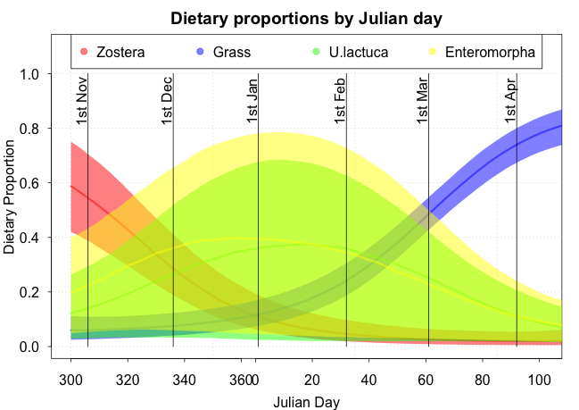

```{r setup, include=FALSE}
knitr::opts_chunk$set(echo = FALSE, fig.width = 7, fig.align = 'center')
library(tidyverse)
library(viridis)
library(simmr)
library(readxl)
```

<script src="https://ajax.googleapis.com/ajax/libs/jquery/1.12.2/jquery.min.js"></script>

<script>
    $(document).ready(function() {
      $('slide:not(.title-slide, .backdrop, .segue)').append('<footer label=\"Bayesian Mixing Models | Andrew Parnell\"></footer>');    
    })
</script>

<style>
  footer:after {
    content: attr(label);
    font-size: 12pt;
    position: absolute;
    bottom: 30px;
    left: 200px;
    line-height: 1.9;
  }
</style>

# How can we estimate what an animal is eating without killing it?

## An introduction to stable isotopes

- Stable isotopes are components of an element which do not decay

- We can measure stable isotopes from your tissues (blood, hair, feathers, ...) in relation to a standard

- We can also measure them from the food sources you consume

- Subject to some further assumptions and corrections your tissue samples will be a weighted sum of the food sources you consume

## A 1 isotope example

```{r, fig.height = 2, fig.align = 'center'}
df = tibble(
  x = c(-5,0,10),
  y = rep(0,length(x)),
  label = c('Chips','You','Beans')
)
ggplot(df, aes(x = x, y = y, colour = label, shape = label)) + 
  geom_point(size = 2) + 
  theme_minimal() + 
  labs(y = '',
       x = expression(paste(delta^13, "C (\u2030)",sep=""))) +
  scale_x_continuous(breaks = scales::pretty_breaks(n = 20)) +
  theme(axis.title.y=element_blank(),
        axis.text.y=element_blank(),
        axis.ticks.y=element_blank(),
        panel.grid.major.y = element_blank(),
        panel.grid.minor.y = element_blank(),
        text = element_text(size=20),
        legend.position = 'None') + 
  annotate('text', x = df$x, y = df$y + 0.1, label = df$label,
           size = 5) + 
  lims(y = c(-0.05,0.2))
```

$$\mbox{You} = p_1 \mbox{Chips} + p_2 \mbox{Beans}$$
What is $p_1$ and $p_2$?

## A more complicated 1 isotope example

```{r, fig.height = 2, fig.align = 'center'}
df = tibble(
  x = c(-5,0,10, 12),
  y = rep(0,length(x)),
  label = c('Chips','You','Beans', 'Falafel')
)
ggplot(df, aes(x = x, y = y, colour = label, shape = label)) + 
  geom_point(size = 2) + 
  theme_minimal() + 
  labs(y = '',
       x = expression(paste(delta^13, "C (\u2030)",sep=""))) +
  scale_x_continuous(breaks = scales::pretty_breaks(n = 20)) +
  theme(axis.title.y=element_blank(),
        axis.text.y=element_blank(),
        axis.ticks.y=element_blank(),
        panel.grid.major.y = element_blank(),
        panel.grid.minor.y = element_blank(),
        text = element_text(size=20),
        legend.position = 'None') + 
  annotate('text', x = df$x, y = df$y + 0.1, label = df$label,
           size = 5) + 
  lims(y = c(-0.05,0.2))
```

$$\mbox{You} = p_1 \mbox{Chips} + p_2 \mbox{Beans} + p_3 \mbox{Falafel}$$

What are $p_1$, $p_2$, and $p_3$?

## Including uncertainties

```{r}
mix = matrix(c(-10.13, -10.72, -11.39, -11.18, -10.81, -10.7, -10.54, 
               -10.48, -9.93, -9.37), ncol=1, nrow=10)
colnames(mix) = c('d13C')
s_names = c("Chips", "Beans", "Falafel")
s_means = matrix(c(-14, -15.1, -11.03), ncol=1, nrow=3)
s_sds = matrix(c(0.48, 0.38, 0.48), ncol=1, nrow=3)
c_means = matrix(c(2.63, 1.59, 3.41), ncol=1, nrow=3)
c_sds = matrix(c(0.41, 0.44, 0.34), ncol=1, nrow=3)
conc = matrix(c(0.02, 0.1, 0.12), ncol=1, nrow=3)
simmr_in_1D = simmr_load(mixtures=mix,
                     source_names=s_names,
                     source_means=s_means,
                     source_sds=s_sds,
                     correction_means=c_means,
                     correction_sds=c_sds,
                     concentration_means = conc)
plot(simmr_in_1D, 
     xlab = expression(paste(delta^13, "C (\u2030)",sep="")),
     mix_name = 'Us',
     title = '')
```

$$\mbox{You} = p_1 \mbox{Chips} + p_2 \mbox{Beans} + p_3 \mbox{Falafel} + \epsilon$$

## Moving into 2 isotopes

```{r}
mix = matrix(c(-10.13, -10.72, -11.39, -11.18, -10.81, -10.7, -10.54, 
               -10.48, -9.93, -9.37, 11.59, 11.01, 10.59, 10.97, 11.52, 11.89, 
               11.73, 10.89, 11.05, 12.3), ncol=2, nrow=10)
colnames(mix) = c('d13C','d15N')
s_names = c("Chips", "Beans", "Falafel")
s_means = matrix(c(-14, -15.1, -11.03, -14.44, 3.06, 7.05, 13.72, 5.96), ncol=2, nrow=4)[-4,]
s_sds = matrix(c(0.48, 0.38, 0.48, 0.43, 0.46, 0.39, 0.42, 0.48), ncol=2, nrow=4)[-4,]
c_means = matrix(c(2.63, 1.59, 3.41, 3.04, 3.28, 2.34, 2.14, 2.36), ncol=2, nrow=4)[-4,]
c_sds = matrix(c(0.41, 0.44, 0.34, 0.46, 0.46, 0.48, 0.46, 0.66), ncol=2, nrow=4)[-4,]
conc = matrix(c(0.02, 0.1, 0.12, 0.04, 0.02, 0.1, 0.09, 0.05), ncol=2, nrow=4)[-4,]
simmr_in = simmr_load(mixtures=mix,
                     source_names=s_names,
                     source_means=s_means,
                     source_sds=s_sds,
                     correction_means=c_means,
                     correction_sds=c_sds,
                     concentration_means = conc)
plot(simmr_in,xlab=expression(paste(delta^13, "C (\u2030)",sep="")), 
     ylab=expression(paste(delta^15, "N (\u2030)",sep="")), 
     title='',
     mix_name = 'Us')
```

## Geese data

```{r}
path = system.file("extdata", "geese_data.xls", package = "simmr")
geese_data = lapply(excel_sheets(path), read_excel, path = path)
targets = geese_data[[1]]
sources = geese_data[[2]]
TEFs = geese_data[[3]]
concdep = geese_data[[4]]
geese_simmr = simmr_load(mixtures = as.matrix(targets[, 1:2]),
                         source_names = sources$Sources,
                         source_means = sources[,2:3],
                         source_sds = sources[,4:5],
                         correction_means = TEFs[,2:3],
                         correction_sds = TEFs[,4:5],
                         concentration_means = concdep[,2:3],
                         group = as.factor(paste('Day', targets$Time)))
plot(geese_simmr,xlab=expression(paste(delta^13, "C (\u2030)",sep="")), 
     ylab=expression(paste(delta^15, "N (\u2030)",sep="")), 
     title='Isospace plot of Geese data',
     mix_name = "Geese", 
     group_name = 'Day 93')
```

## Geese background

<iframe src="https://player.vimeo.com/video/387265148?title=0&portrait=0" width="640" height="300" frameborder="0" allow="autoplay; fullscreen" allowfullscreen></iframe>
<p><a href="https://vimeo.com/387265148">Dublin Bay Biosphere Brent Geese Video</a> from <a href="https://vimeo.com/1minute40">1 minute 40</a> on <a href="https://vimeo.com">Vimeo</a>.</p>

## Statistical model

 blue = data, red = parameters

$$ \color{blue}{y_{ij}} \sim N \left( \sum_{k=1}^K \color{red}{p_k s_{ijk}}, \color{red}{\sigma_j}^2 \right)$$

$$ \color{red}{s_{ijk}} \sim N \left( \color{blue}{\mu_{sjk}}, \color{blue}{\sigma_{sjk}}^2 \right)$$


$$ \color{red}p \sim Dirichlet(\color{blue}{\alpha_1}, \ldots, \color{blue}{\alpha_K})$$
$$ \sigma_j \sim t_1^{+}$$

## Model fitting

- We follow a Bayesian inference approach that allows for prior information to be incorporated on the parameters of the Dirichlet distribution

- All models fitted using Markov chain Monte Carlo using JAGS or Stan depending on the implementation

- We obtain posterior distributions of the dietary proportions $p$ which enable us to estimate the proportional contribution of the food sources the animal is eating

- Posterior predictive distributions and cross-validation used to confirm model fit

## Results

```{r, results = 'hide', message = FALSE}
geese_simmr_2 = simmr_load(mixtures = as.matrix(targets %>% 
                                                  filter(Time == 93))[,1:2],
                         source_names = sources$Sources,
                         source_means = sources[,2:3],
                         source_sds = sources[,4:5],
                         correction_means = TEFs[,2:3],
                         correction_sds = TEFs[,4:5],
                         concentration_means = concdep[,2:3])
# plot(geese_simmr_2,xlab=expression(paste(delta^13, "C (\u2030)",sep="")), 
#      ylab=expression(paste(delta^15, "N (\u2030)",sep="")), 
#      title='Isospace plot of Geese data',
#      mix_name = "Geese day 93")
simmr_out = simmr_mcmc(geese_simmr_2)
plot(simmr_out, type = 'histogram',
     title = 'Dietary proportions for geese on day 93')
```

## Geese data changing over time

```{r}
plot(geese_simmr,xlab=expression(paste(delta^13, "C (\u2030)",sep="")), 
     ylab=expression(paste(delta^15, "N (\u2030)",sep="")), 
     title='Isospace plot of Geese data',
     mix_name = "Geese")
```


## Building in covariates

- Need to tie the proportions $p$ to covariates such as time

- Use the soft-max transformation:
$$p_k(t) = \frac{ \exp( \theta_k(t) ) }{ \sum_l \exp( \theta_l(t) )}$$

- Now the latent $\theta_k$ values are modelled using standard time series or regression methods, e.g.

$$\theta_k(t) = \beta_{0k} + \beta_{1k} t$$

## Results

```{r}

```

## Another example - Wolves

```{r}

```

## Other examples

- Fatty acids: multiple (often >10) tracers instead of isotopes

- River source apportionment

- Neanderthal diets

- Sea level reconstruction

## R packages for SIMMs

```{r, echo=FALSE,out.width="49%", out.height="20%",fig.cap=" ",fig.show='hold',fig.align='center'}
knitr::include_graphics(c("simmr_pack.png","mixsiar_pack.png"))
``` 

## Some lessons learned

- It is not always the most complex models or latest statistical developments that have the greatest impact

- Including software packages with papers massively improves citations and impact of work

- Getting (non-statistical) collaborators to write the user manual can help with wider circulation and use

- Social media unfortunately can play in role in the dissemination of your work

## Possible extensions and opportunities for collaboration

- Faster fitting methods (variational Bayes, INLA)

- Moving from diet to food webs

- Including multiple tissue types and equilibrium diets

<br>
<div class="centered">
<b>Thank you!</b>
<br>
https://is.gd/bsimms
</div>

<font size="2"> Stock, B. C., Jackson, A. L., Ward, E. J., Parnell, A. C., Phillips, D. L., & Semmens, B. X. (2018). Analyzing mixing systems using a new generation of Bayesian tracer mixing models. PeerJ, 6, e5096.
<br>
Parnell, Andrew C., Donald L. Phillips, Stuart Bearhop, Brice X. Semmens, Eric J. Ward, Jonathan W. Moore, Andrew L. Jackson, Jonathan Grey, David J. Kelly, and Richard Inger. Bayesian stable isotope mixing models. Environmetrics 24, no. 6 (2013): 387-399.
</font> 


